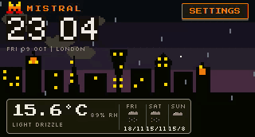
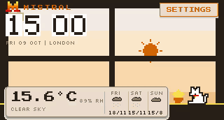
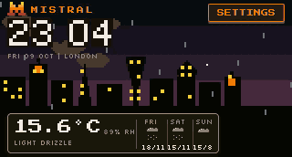
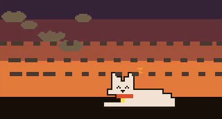
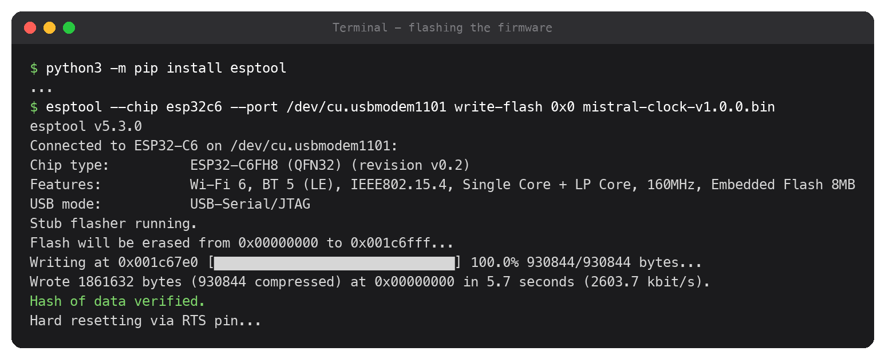
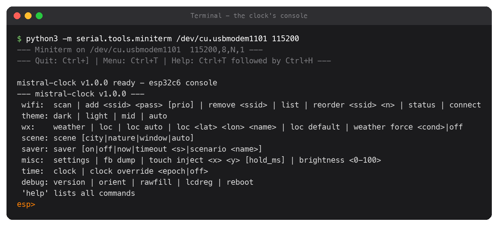
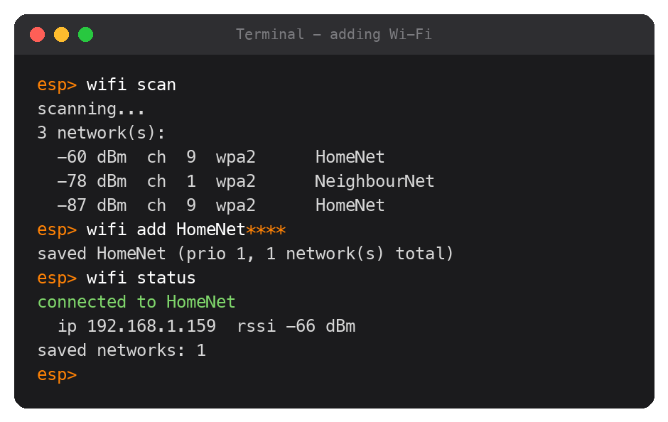
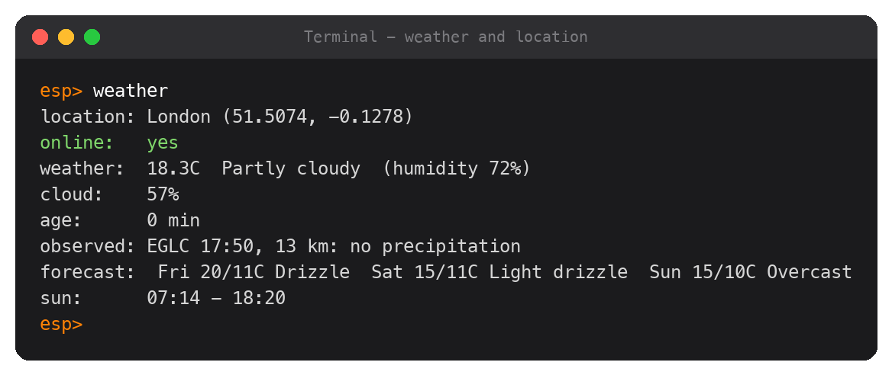
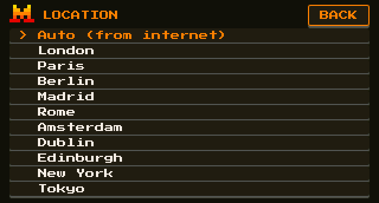

# Mistral Clock

A small desk clock with a big pixel-art face, a live background that matches
the real weather outside, a 3-day forecast and a Mistral pixel-cat
screensaver. It runs on its own over Wi-Fi: no app, no account, no API keys.


## Gallery

Screen recordings of the firmware's own rendering (320x172, shown at native
size). Each clip links to the original MP4.

<table>
  <tr>
    <td align="center"><a href="docs/media/home-city-night.mp4"></a><br>Home: city at night</td>
    <td align="center"><a href="docs/media/home-window-day.mp4"></a><br>Home: window by day</td>
  </tr>
  <tr>
    <td align="center"><a href="docs/media/home-to-saver-rain.mp4"></a><br>Home to screensaver, light drizzle</td>
    <td align="center"><a href="docs/media/saver-rain-night.mp4"></a><br>Rainy night nap</td>
  </tr>
  <tr>
    <td align="center"><a href="docs/media/saver-umbrella-night.mp4"></a><br>Night rain</td>
    <td align="center"><a href="docs/media/saver-fish-rain-day.mp4"></a><br>Lunch in the rain</td>
  </tr>
  <tr>
    <td align="center"><a href="docs/media/saver-sunny-day.mp4"></a><br>Clear day</td>
    <td align="center"><a href="docs/media/saver-chase-dusk.mp4"></a><br>Chasing the M at dusk</td>
  </tr>
  <tr>
    <td align="center"><a href="docs/media/saver-play-sunset.mp4"></a><br>Yarn at sunset</td>
    <td align="center"><a href="docs/media/saver-loaf-sunset.mp4"></a><br>Sunset loaf</td>
  </tr>
</table>

## What you need

| Item | Notes |
|---|---|
| **Waveshare ESP32-C6-Touch-LCD-1.47** | The **Touch** version: 1.47" 320x172 touchscreen, ESP32-C6, 8 MB flash. [Product page](https://www.waveshare.com/esp32-c6-touch-lcd-1.47.htm), [wiki](https://www.waveshare.com/wiki/ESP32-C6-Touch-LCD-1.47) |
| **USB-C cable that carries data** | Charge-only cables don't work for setup |
| **A computer with Python 3** | macOS, Windows or Linux, only for the one-time setup ([python.org](https://www.python.org/downloads/)) |
| **2.4 GHz Wi-Fi** | The ESP32-C6 has no 5 GHz radio |
| A USB power adapter (optional) | After setup the clock only needs power |

No soldering, no case required. A 3D-printable retro computer case is in
[`hardware/`](hardware/README.md), with the full bill of materials and print
settings.

## Setup (about 10 minutes)

### 1. Flash the firmware

Download `mistral-clock-v1.0.0.bin` from the
[latest release](../../releases/latest), plug the board into your computer and
find its port:

| System | How to find the port | Looks like |
|---|---|---|
| macOS | `ls /dev/cu.usbmodem*` | `/dev/cu.usbmodem1101` |
| Linux | `ls /dev/ttyACM*` | `/dev/ttyACM0` |
| Windows | Device Manager, Ports (COM & LPT) | `COM5` |

Then install the flashing tool and flash (replace the port with yours):

```sh
python3 -m pip install esptool
esptool --chip esp32c6 --port /dev/cu.usbmodem1101 write-flash 0x0 mistral-clock-v1.0.0.bin
```



The clock restarts and shows `--:--` until it is online. Flashing the full
image also erases saved settings, so a re-flash means adding Wi-Fi again.

### 2. Open the clock's console

`esptool` installed a small terminal program with it:

```sh
python3 -m serial.tools.miniterm /dev/cu.usbmodem1101 115200
```

Press **Enter** to see the menu. Quit with **Ctrl+]**.



### 3. Add your Wi-Fi

```text
wifi scan
wifi add "My Network" my-password
wifi status
```

Put the network name in quotes if it has spaces. The password is masked while
you type and is never printed.



### 4. Done

Within a minute the clock sets its time, works out roughly where it is from
your internet connection, and shows the weather. Type `weather` to see what it
found:



You can now unplug it from the computer and power it from any USB charger. It
remembers everything.

## Using it

- **SETTINGS** (top right) shows the network, signal and firmware version, and
  lets you change:
  - **LOC**: the location. "Auto (from internet)" finds it from your
    connection; or pick a city.
  - **THEME**: dark, light, mid (amber) or auto (follows sunrise and sunset).
  - **SAVER**: screensaver after 30 s to 10 min of no touch, or off.
- **Screensaver**: full-screen pixel art with the cat, in the real weather.
  Tap to wake.



## Wi-Fi: several networks, new computers

The clock keeps up to **8 Wi-Fi networks**. Whenever it is offline it scans
and joins the strongest saved network in range by itself. Add more networks
the same way, any time, from any computer: plug in USB, open the console
(step 2) and use `wifi add`. No re-flash is needed.

| Command | Does |
|---|---|
| `wifi add "<name>" <password> [priority]` | Save a network (priority 1 = preferred when signals are similar) |
| `wifi list` | Show saved networks |
| `wifi remove "<name>"` | Forget a network |
| `wifi reorder "<name>" <priority>` | Change a network's priority |
| `wifi status` | Current connection |

Not supported: hidden networks, 5 GHz-only networks, and networks that need a
login page or a username (eduroam, hotel and cafe portals).

## Location

`loc` shows where the clock thinks it is. The automatic location comes from
your public IP address, which is usually the right town but can be off by a few
tens of km (and a VPN on your router would move it). To set it exactly:

```text
loc 51.5074 -0.1278 London
```

(latitude, longitude, any name; your map app shows the coordinates). `loc auto`
switches back to automatic.

## Troubleshooting

| Problem | Try |
|---|---|
| No port appears | Use a data USB cable; try another USB port |
| `esptool` cannot connect | Unplug, hold the **BOOT** button while plugging back in, then flash again |
| Clock shows `--:--` / "time not synced" | It is not online yet: `wifi status`, then check the name and password |
| Weather looks wrong for your area | `loc` to check the location; set it exactly (see Location) |
| Console shows nothing or says the port is busy | Press Enter; close other programs using the port (only one at a time) |

## Where the data comes from

- Forecast, temperature and sun times: [Open-Meteo](https://open-meteo.com/)
  (free, no key; weather data by Open-Meteo.com, CC BY 4.0).
- What is falling right now: the nearest airport weather report (METAR) from
  [aviationweather.gov](https://aviationweather.gov/) (NOAA), because forecast
  models often miss local showers.
- Automatic location: [ipinfo.io](https://ipinfo.io/), falling back to
  [ipapi.co](https://ipapi.co/).

## Building from source

The firmware is C on ESP-IDF 5.5 with LVGL 9.3, built with PlatformIO:

```sh
pio run -t upload
```

Use PlatformIO Core 6.2 or newer; the pinned platform and component versions
are downloaded on the first build. The port is auto-detected; add
`upload_port` to `platformio.ini` if several boards are connected.

The [developer reference](docs/REFERENCE.md) has every console command, the
host tools, the end-to-end test suite and the build details.

## License

[PolyForm Strict 1.0.0](LICENSE.md): free for personal and other noncommercial
use. Commercial use, modified versions and redistribution are not allowed.
Third-party parts (the board drivers in `components/`, the fonts, and the
libraries downloaded at build time) keep their own licences.

## Credits

Fonts: Press Start 2P and Silkscreen (SIL Open Font License, in
`assets/fonts/`). All pixel art is original. The Mistral "M" and the cat are a
non-commercial homage; Mistral's marks belong to Mistral AI, which does not
endorse this project. Details in [`assets/CREDITS.md`](assets/CREDITS.md).
