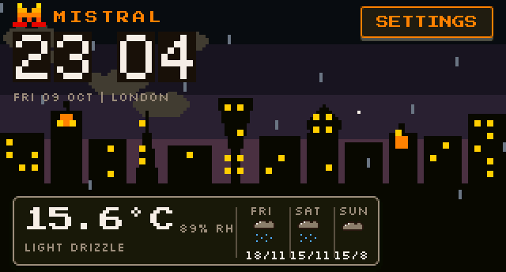

# Mistral Clock: developer reference

The owner-facing setup guide is the [README](../README.md). This page is the full
command, tool and build reference.

A standalone weather clock for the **Waveshare ESP32-C6-Touch-LCD-1.47**
(ESP32-C6 + 1.47" 320x172 touch LCD), styled after Mistral's visual identity:
pixel-art logo, warm yellow/orange/red palette, cream backgrounds, an
animated Mistral pixel-cat screensaver, and live weather/time-of-day
scenes (city / nature / window) colour-graded per theme.



*Rendered by the firmware's own scene code on the host (`tools/sim`); the home
screens use real widgets captured from the device with `fb dump raw`.*

Firmware: ESP-IDF 5.5 + LVGL 9.3 (via `esp_lvgl_port`), C, PlatformIO.

## Hardware

| Item | Value |
|---|---|
| Chip | ESP32-C6FH8 (RISC-V, 160 MHz, single core) |
| Flash | 8 MB, QIO 80 MHz (no PSRAM) |
| Board | Waveshare ESP32-C6-Touch-LCD-1.47 |
| Display | JD9853, GRAM 240x320, visible window CASET 34..205 / RASET 0..319, RGB565, MADCTL 0x00 (glass is landscape 320x172) |
| Touch | AXS5106L on I2C addr 0x63 (SDA 18 / SCL 19, INT 21, RST 20) |
| Console | Native USB-Serial/JTAG (keeps esptool auto-reset working; USB pins never repurposed, no deep sleep) |
| BSP | `components/esp_bsp` (vendor), vendor gamma kept |

## Build, flash, monitor

```sh
pio run                  # build (env esp32-c6-touch-lcd-1-47)
pio run -t upload        # flash (port auto-detected, 921600 baud)
pio device monitor       # serial console at 115200
```

Use PlatformIO Core 6.2 or newer; older Core releases ship a SCons that cannot
build this platform. If several boards are connected, add `upload_port` and
`monitor_port` to `platformio.ini`.

If `sdkconfig.defaults` changed, delete the generated sdkconfig first:
`rm -f sdkconfig.esp32-c6-touch-lcd-1-47`.

Versions are pinned: `platformio.ini` names the exact pioarduino platform
release (ESP-IDF 5.5.4) and `dependencies.lock` the managed components
(LVGL 9.3.0, esp_lvgl_port 2.9.0, esp_lcd_touch 1.2.1). The firmware version
is `CLOCK_FW_VERSION` in `platformio.ini`.

The build also writes a single merged image (bootloader, partition table and
app) to `.pio/build/esp32-c6-touch-lcd-1-47/firmware.factory.bin`; that is
the release `.bin`, flashed at offset `0x0`.

The host tools need Python 3 with `pyserial` (and `Pillow` for the image
tools), installed in a virtual environment:

```sh
python3 -m venv .venv && source .venv/bin/activate
python -m pip install pyserial Pillow
```

## Back up the stock firmware

The board ships with Waveshare's demo firmware. To keep a copy before the
first flash (keep it private; it is Waveshare's firmware):

```sh
python -m esptool --chip esp32c6 --port PORT --baud 921600 read-flash 0x0 0x800000 stock-8mb.bin
# restore later with:
python -m esptool --chip esp32c6 --port PORT --baud 921600 write-flash 0x0 stock-8mb.bin
```

## Console

Open a terminal on the board's port at 115200 baud. The board prints a
short menu when a terminal opens: the USB-Serial/JTAG peripheral has no
DTR/port-open signal, so the firmware watches for the host starting to drain
the CDC IN endpoint (which macOS/Linux hosts only do while a terminal has the
port open) and prints the menu on that edge. Fallbacks: the first input after
>= 3 s of console silence, and a genuinely empty line. Every menu action is
also a one-line command, so everything is scriptable. `help` lists every
command with its usage. See the command reference below.

Wi-Fi passwords are never printed, echoed or logged (a fixed `****` mask).

### Wi-Fi (NVS, priority-ordered, passwords never logged)

| Command | Effect |
|---|---|
| `wifi scan` | Scan all channels; list in-range SSIDs with RSSI |
| `wifi add <ssid> <pass> [prio]` | Save a network (fixed `****` mask, never the password); an optional priority inserts it at that position |
| `wifi remove <ssid>` | Remove a saved network |
| `wifi list` | Saved networks in priority order (names shown) |
| `wifi reorder <ssid> <n>` | Move a network to priority `n` (strict order) |
| `wifi status` | Connected SSID, IP, RSSI, saved count |
| `wifi connect` | Reconnect now to the strongest saved network in range |

On boot the board connects to the strongest saved network in range (an
all-channel scan picks it; the connection is pinned to that BSSID and
channel) with exponential backoff; it needs no USB host. Multiple networks
are kept in NVS with priorities. NVS is not encrypted (no flash encryption
on this hobby build): erase the flash (`esptool erase_flash`) before giving
the board away.

### Weather / location (Open-Meteo + airport observations, no API keys; Europe/London, DST via TZ string)

Two sources, both keyless. Open-Meteo (a forecast model) supplies temperature,
humidity, cloud cover, sunrise/sunset and the 3-day forecast. Models often miss
local showers, so what is falling *right now* comes from the nearest airport
weather report (METAR, aviationweather.gov) within ~30 km, refreshed every
15 min and used while under 90 min old: rain, drizzle, snow, thunder or fog
seen by the station drives the condition text, the scene and the screensaver.
It only adds weather the model missed; it never removes rain the model shows.

| Command | Effect |
|---|---|
| `weather` | Force a refresh; prints current, humidity, cloud, cache age, the airport observation in use, 3-day forecast |
| `weather force <cond>\|off` | Debug override: `clear\|partly\|cloud\|fog\|drizzle\|rain\|snow\|storm` (scene + condition follow it) |
| `loc <lat> <lon> <name>` | Set location (lat -90..90, lon -180..180, name up to 23 chars); triggers an immediate refetch; persisted; ends auto mode |
| `loc auto` | Automatic location from the clock's internet connection (IP lookup at connect and daily; also "Auto" at the top of the touch city list) |
| `loc default` | Reset to London (51.5074, -0.1278), manual |
| `loc` | Show current location and mode (auto/manual). A fresh device starts in auto. IP lookups find the provider's nearest hub (usually the right town); a VPN on the router would move it |

Offline is a normal state: the last known weather is shown with its age, and
the clock shows a red `--:--` / `TIME NOT SYNCED` until SNTP syncs. Forced
fetches are throttled to one per 10 s (a location change always refetches);
failed fetches back off from 30 s doubling to 30 min. Sun times are in
London time, so the day can wrap past midnight for far-away presets (Tokyo):
the auto theme and the scene handle that.

### Themes / scene / screensaver

| Command | Effect |
|---|---|
| `theme dark\|light\|mid\|auto` | Set theme (persisted). `auto` = light by day, dark by night, mid within 45 min around sunrise/sunset (sun times from Open-Meteo) |
| `theme` | Show mode + active palette |
| `scene city\|nature\|window\|auto` | Home background layer (persisted); `auto` picks per time of day |
| `saver on\|off` | Enable/disable the screensaver (persisted) |
| `saver timeout <s>` | Idle timeout in seconds (default 120) |
| `saver now` | Enter the screensaver immediately |
| `saver scenario <auto\|sleep\|loaf\|chase\|eat\|mchase\|curl>` | Pin a cat scenario |
| `saver neutral on\|off` | Force the neutral indoor scene |
| `saver` | Status: on/off, timeout, idle, scenario, current screen |

The screensaver is full-screen art only (no text). Its environment is truthful:
sky, light and weather effects come from the latest real Open-Meteo data and
real sunrise/sunset; if data is missing or older than 3 h (or the clock is
unsynced) it shows a neutral indoor scene. A tap returns to the home screen;
any touch resets the idle timer.

### Console / debug / touch

| Command | Effect |
|---|---|
| `settings` / `home` | Open the settings screen / return home (also exits the saver) |
| `fb dump` (alias `fb`) | Stream the framebuffer as checksummed base64 rows (`tools/fbdump.py` turns it into a PNG, ~13 s per dump at 115200 baud) |
| `fb dump raw` | Same, but without the scene composite (theme-background key pixels left in place): the input for `tools/sim` to animate the home screen |
| `touch inject <x> <y> [hold_ms]` | Simulate a tap at glass coordinates (hold 0..5000 ms, default 150) |
| `touch up` | Release an injected touch |
| `touch i2c` | Probe the AXS5106L (0x63), dump raw registers, driver state |
| `touch raw` | Controller state via the driver |
| `brightness <0-100>` | Panel backlight |
| `clock` | Time status: synced, TZ (`GMT0BST,M3.5.0/1,M10.5.0`), SNTP, override |
| `clock override <epoch\|off>` | Debug clock; drives theme-auto and the scene phase (dawn/day/sunset/night) |
| `version` / `info` | Firmware version / chip, free heap, panel mapping |
| `menu` | Print the command menu (same as an empty line / first input) |
| `usbmon` | USB-Serial/JTAG host/port-open monitor state (menu trigger) |
| `orient` / `rawfill` / `lcdreg` | Panel debug helpers |
| `invert on\|off`, `mirror <x> <y>`, `gap <x> <y>`, `madctl <hex>`, `rawgrid`, `fill <rgb565>`, `repaint`, `lvdbg` | Lower-level panel / LVGL debug helpers |
| `hello` | Print the firmware name and version |
| `reboot` | Restart |
| `help [cmd]` | List every command with usage, or one command's summary |

## Host tools (`tools/`)

Every tool that talks to the board finds the port the same way: `--port`,
then the `CLOCK_PORT` environment variable, then the single connected
Espressif USB device. Outputs go to `logs/` (not committed).

| Tool | Purpose |
|---|---|
| `console.py` | Serial console helper: `boot`, `cmd "..." "..."`, `raw CMD SECONDS`, `monitor SECONDS` |
| `fbdump.py` | `fb dump` to a validated PNG (row and whole-buffer fletcher16 checksums, little-endian RGB565) |
| `validate_e2e.py` | Scripted end-to-end validation over serial: Wi-Fi, time, weather, location, themes, scenes, screensaver, touch, offline reboot and DST edges; writes `logs/e2e/` |
| `console_check.py` | Console behaviour checks (`help`, menu on a fresh terminal, CR+LF handling) |
| `auto_theme_check.py` | Steps the debug clock through a whole day and checks the auto theme |
| `reset.py` | Reset the board through the USB-Serial/JTAG auto-reset lines |
| `gen_pixel_art.py`, `gen_sprite_art.py`, `gen_chaton.py`, `gen_clock_digits.py` | Generate the pixel-art headers in `src/assets/` from authored grids |
| `make_setup_screenshots.py` | Render the README setup screenshots in `docs/setup/` |
| `sim/render.py` | Host simulator: renders the real `scene.c` / `scene_chaton.c` to PNG, GIF or sprite sheets |
| `sim/make_readme_gif.py` | Builds `docs/demo.gif` from the simulator and `fb dump raw` captures |

Run the end-to-end validation with a test network that is in range (its
credentials come from the environment and are never written to the repo or
the log):

```sh
export CLOCK_TEST_WIFI_SSID='<test network SSID>'
export CLOCK_TEST_WIFI_PASS='<test network password>'
python tools/validate_e2e.py        # about 8 minutes; exit code 0 = all checks passed
python tools/console_check.py
```

## Design assets and licences

All artwork is original, authored as pixel grids in the `tools/gen_*.py`
scripts (the pixel "M", the cat, weather icons, clock digits, the skyline,
hills and window layers, lightning). Fonts are Press Start 2P and Silkscreen
(SIL Open Font License 1.1, in `assets/fonts/`). Full provenance is in
[`assets/CREDITS.md`](../assets/CREDITS.md).

## Layout of the repo

```
src/            firmware (main, ui_home/ui_settings/ui_loc, scene, saver,
                scene_chaton, theme_mgr, weather_mgr, wifi_mgr, time_mgr,
                console, touch, fbdump, display)
src/assets/     generated pixel art (C headers)
src/fonts/      LVGL bitmap fonts converted from assets/fonts
components/     board support and LCD/touch drivers from the Waveshare demo
assets/         source fonts and the Mistral "M" reference
hardware/       3D-printable case (3MF, STL), bill of materials, photos
docs/           demo GIF, screen recordings, setup screenshots, this page
tools/          host tools (see above); tools/sim = host scene simulator
```
