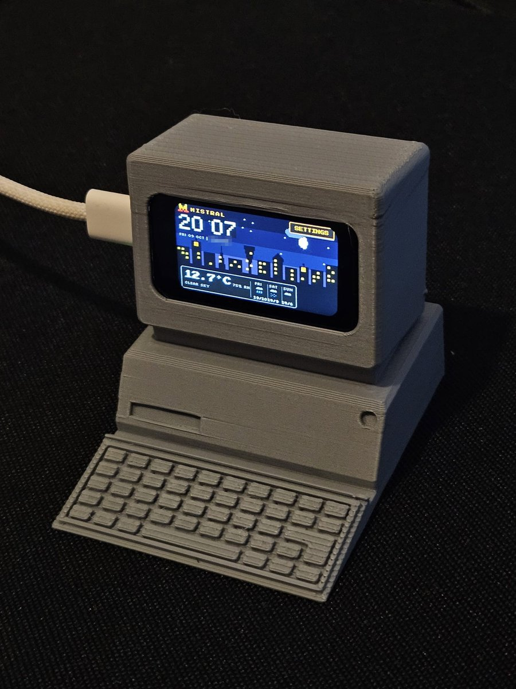
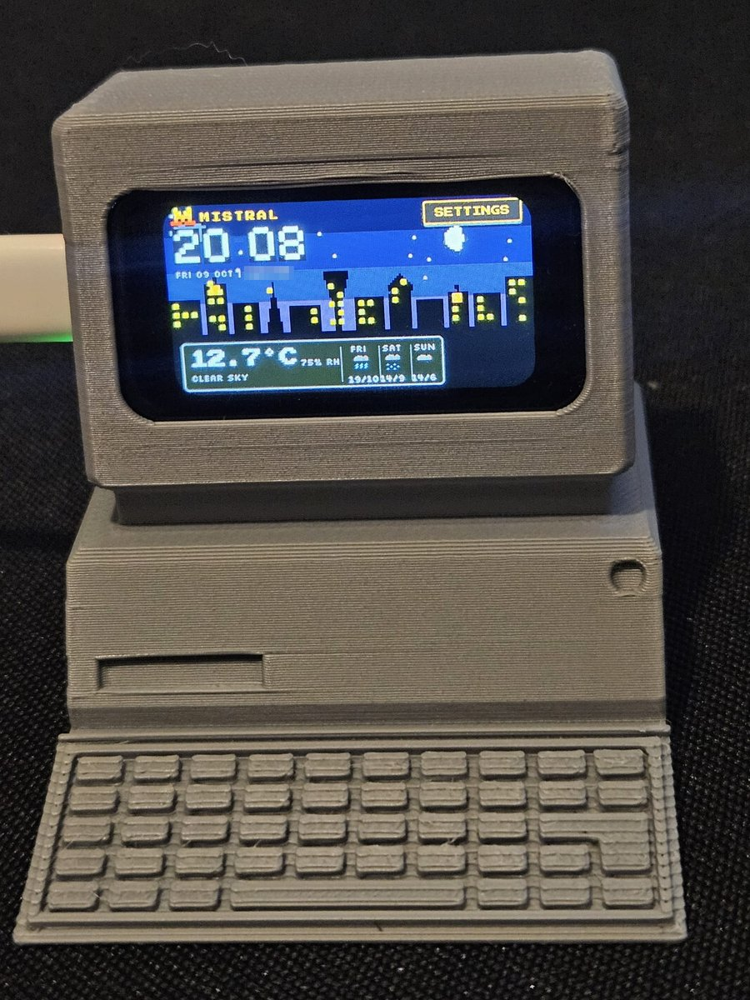
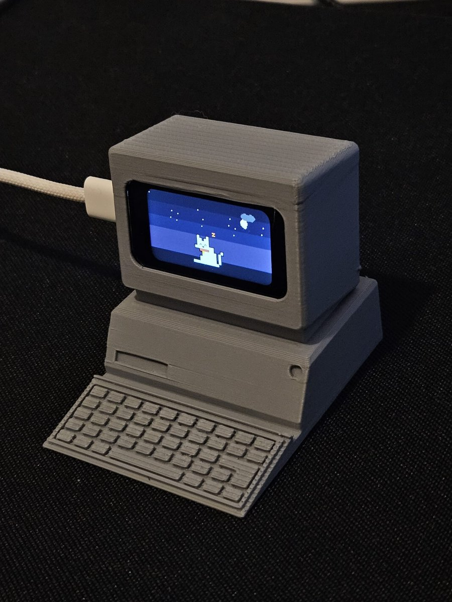
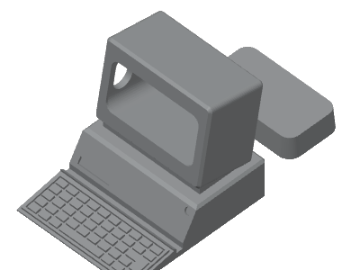

# Hardware

The clock is a single off-the-shelf board. The optional 3D-printed case turns
it into a small retro desktop computer, with the screen in the monitor.

<table>
  <tr>
    <td></td>
    <td></td>
    <td></td>
  </tr>
</table>

The case as printed, in grey PLA. The plate in the slicer:

## Bill of materials

| Qty | Part | Notes |
|---|---|---|
| 1 | [Waveshare ESP32-C6-Touch-LCD-1.47](https://www.waveshare.com/esp32-c6-touch-lcd-1.47.htm) | The **Touch** version: ESP32-C6FH8, 8 MB flash, 1.47" 320x172 JD9853 LCD, AXS5106L touch controller |
| 1 | USB-C cable that carries data | Needed once for flashing and Wi-Fi setup; charge-only cables do not work |
| 1 | 5 V USB power adapter | Any phone charger works |
| 1 | 3D-printed case (optional) | Two parts; files below |

No soldering and no other electronics are needed.

## Case files

| File | Contents |
|---|---|
| [`mistral_clock.3mf`](mistral_clock.3mf) | Ready-to-slice Bambu Studio project: both parts placed on one plate, with the print settings below |
| [`mistral_clock_case.stl`](mistral_clock_case.stl) | The same two parts as a plain STL mesh, for any slicer |

The two parts are the computer body (monitor, base and keyboard) and the back
cover.

## Print settings

These are the settings saved in the 3MF (Bambu Lab X1 Carbon). Any FDM
printer with a 0.4 mm nozzle works with equivalent settings.

| Setting | Value |
|---|---|
| Material | PLA (matte PLA in the project) |
| Nozzle | 0.4 mm |
| Layer height | 0.20 mm |
| Walls | 2 |
| Infill | 15 % |
| Supports | Tree supports, on the build plate only |

## Assembly

1. Flash the firmware and add Wi-Fi first (see the [main README](../README.md));
   the console is easier to reach before the board is in the case.
2. Seat the board in the monitor opening with the screen facing out.
3. Fit the back cover and connect the USB-C power cable.
